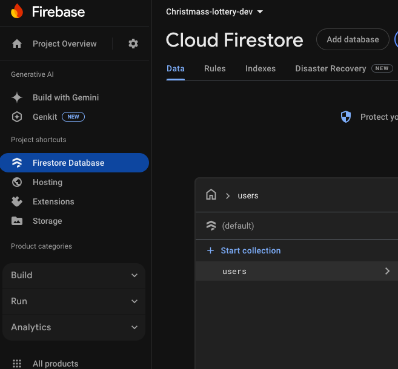

# Christmas lottery setup

1. `environment.ts` files contain firebase configuration. Create firebase database with collection called 'users' and add proper firebase configuration to environment.ts file.

There are two environment files - one for production and one for development.
2. Go to `src/app/services/user.service.ts` and add a list of users for the lottery.
3. Try out if everything works. Serve app with `ng serve`. Go to `http://localhost:4200/stats`, provide a password and click "dodaj osoby". This will prepare firebase database with list of users from user.service with required structure.
This view will give you information for production if the lottery is going as expected - people already drawn and duplicates. By default, the password is admin. You can change this in `src/app/stats/stats.component.ts`
> If there is any duplicate this means that the lottery is faulty and someone will not receive a present
4. Everything is fine? Prepare firebase for production and repeat step 3 on your production server.
